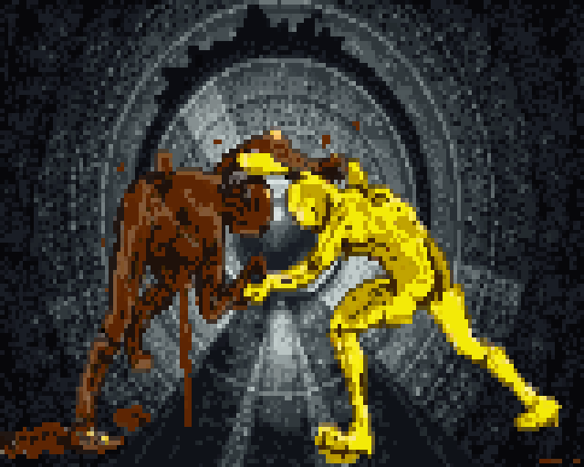
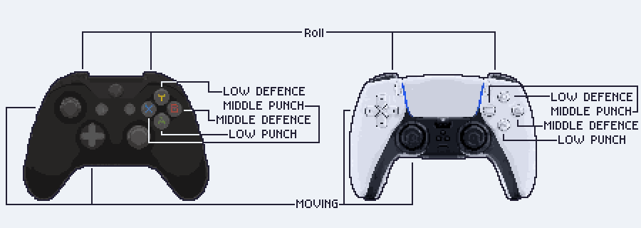

# Sewermaid

**Sewermaid** is a Godot-based action-arcade game (jam project) where you play as a sewer collector cleaning up a nasty underground mess.  
Fight off toxic waste, collect valuables, avoid hazards, and see how long you can survive.



---

### Another Pointless Internet Argument

I present to you a unique fighting game that can be used in any controversial situation! You have time and energy but no arguments? Try our new **fight of shit and urine**. You and your opponent take control of your preferred side and start battling to prove you're right! Of course, your argument will end in nothing, as everything gets flushed down the drain and dissolves into oblivion.

### But I Don’t Have an Opponent Among My Friends

If you don’t have friends or don’t want to hurt them during the fight, there’s a mode where you can beat up a scripted dummy, just to feel better.

### I’m Too Lazy to Prove Anything

In that case, try our unique mode where two scripted dummies fight for you, allowing you to waste your time meaninglessly. This mode can also be used if you can’t make a choice. Just imagine that each avatar represents a decision you’re struggling with.

---

## Controls

Here’s a scheme for **gamepad controls**:



---

## Requirements & Setup

To run/build the project:

1. Install **Godot (version compatible with repo)** — likely 4.x or 3.x depending on project file.  
2. Clone this repo:  
   ```bash
   git clone https://github.com/vydramain/Sewermaid.git
   cd Sewermaid
   ```
